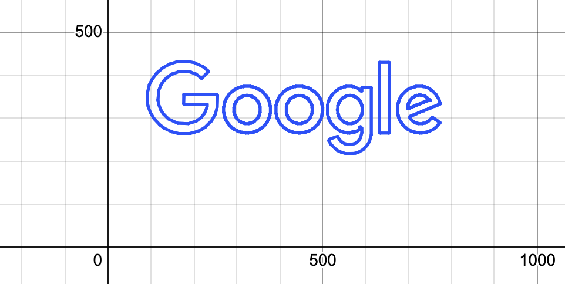
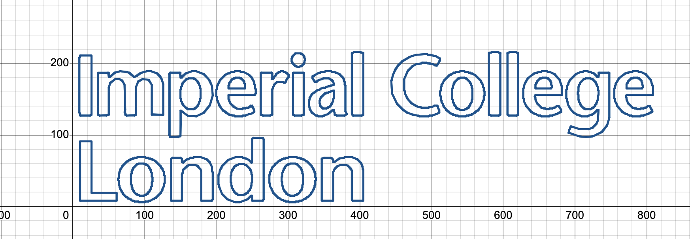

# Desmos-Drawer 🎨✨

Welcome to Desmos-Drawer! This is an open-source project that converts images into a list of equations that can be used in the Desmos Graphing Calculator. Whether you're looking to create art with math or just have some fun, this tool will help you transform any simple image or logo into mathematical equations! 

## Features ✨

- **Convert Images to Equations**: Turn any simple image or logo into a list of equations.
- **Easy to Use**: Adjust a couple of settings in the `main.py` file, run it, and there it is! Your equations are ready.
- **Desmos Ready**: The generated equations in `equations.txt` are ready to be copied and pasted directly into Desmos Graphing Calculator.

## Examples:
Original Image | Drawn Image
--- | ---
 | 
 | 
 | 

## Usage 🚀

1. **Adjust Settings**: Open the `main.py` file and adjust the following settings:

    - `IMAGE_PATH`: Edit this to change the image path. For example: 
    ```python
    IMAGE_PATH = 'Examples/Source/Tesla.png'
    ```
    
    - `INACCURACY_VALUE`: Adjust this to change the accuracy of the approximation. The lower the value, the more accurate the approximation but the more equations will be generated. It is recommended not to go over 0.03 (3%), but feel free to experiment. For optimal performance, pick a small but not too small value. Try: 0.01, 0.005, 0.002 in this order.
    ```python
    INACCURACY_VALUE = 0.002
    ```
   
2. **Run `main.py`**: Run the `main.py` file. This will generate a list of equations in the `equations.txt` file.

3. **Copy and Paste into Desmos**: Open the `equations.txt` file, copy all its contents, and then paste it in the place of the first equation in the Desmos Graphing Calculator.

That's it! Your image should now be represented as a collection of equations in Desmos.

## Note 📌

- It might need few seconds for Desmos to render the equations, so be patient. This is usually happens within 10 seconds. You can know when Desmos is done rendering when colors appear left to the equations.
- You may need to zoom out in Desmos to see the entire representation of the image.
- This tool works best with images that do NOT include too much graphics, but works best with text-only or simple logos. See the `Examples` folder for some examples.
- While this tool was made for Desmos only, the style of writing equations is not too different, so it can be used with other graphing calculators later.

## Contributing 🤝

Contributions are always welcome!


## License 📄

This project is licensed under the MIT License - see the [LICENSE.md](LICENSE.md) file for details.

---

Happy Drawing with Desmos! 🎉